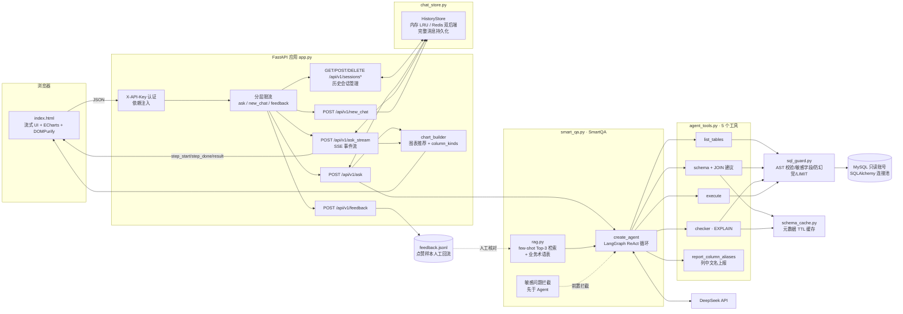
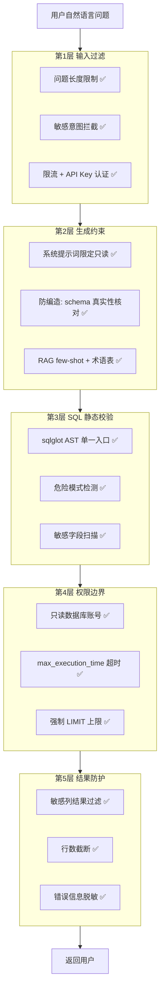

# 智慧问数系统（Smart QA）

基于 LangChain ReAct Agent 的 **NL2SQL 自然语言数据库问答系统**：用中文提问，系统自动生成 SQL、校验执行、返回数据并推荐 ECharts 图表。

技术栈：FastAPI + MySQL（只读账号）+ DeepSeek/OpenAI 兼容大模型 + LangChain 1.x + ECharts。

服务运行时浏览器打开 http://127.0.0.1:5000/docs —— FastAPI 自动生成的交互式文档,每个接口都有参数说明,点 "Try it out" 直接填参数发送,无需写任何代码。

## 功能特性

- **自然语言问数**：`"上个月各部门的销售额是多少？"` → SQL → 数据表 → 图表建议
- **历史会话侧边栏**：会话列表持久化在服务端（内存/Redis），可新建/切换/删除会话，点击历史会话完整回放（回答、SQL、数据、图表）
- **SSE 流式输出**：提问后实时推送工具调用步骤（`/api/v1/ask_stream`），告别漫长等待白屏
- **多轮追问**：会话级上下文（最近 3 轮），支持 `"那按月份拆一下"` 这类追问
- **RAG 增强**（对标 Vanna）：
  - few-shot 检索：从 `rag/examples.jsonl` 自动检索 Top-3 相似示例注入提示词，提升 SQL 生成准确率
  - 业务术语表：`rag/glossary.md` 中的「术语: 定义」启动时注入系统提示词，统一口径（如"活跃用户"的具体定义）
- **反馈闭环**：回答下方 👍/👎 评价沉淀到 `feedback.jsonl`，点赞样本经人工核对后可回流为 few-shot 语料
- **列中文别名**：Agent 查询成功后经 `report_column_aliases` 工具结合问题意图自动上报列中文展示名，`config/column_aliases.yaml`（精确别名 + snake_case 分词合成）作确定性兜底；图表图例/坐标轴/数据表头优先渲染中文别名，无别名时回退原始字段名
- **API Key 认证**：`WEB_API_KEYS` 设置后 `/api/v1/*` 需携带 `X-API-Key`（常量时间比较），留空则本地开发完全开放
- **五层安全防护**：
  1. 问题级敏感关键词拦截（密码/身份证/手机号等）
  2. 生成约束（系统提示词限定只读作答规范）
  3. SQL 静态校验（sqlglot AST：仅单条 SELECT，拒绝 DML/DDL/多语句/加锁/INTO OUTFILE）
  4. 权限边界（只读数据库账号 + 会话级 `max_execution_time` + 强制 LIMIT）
  5. 结果级敏感列过滤（SELECT * 带出的敏感字段自动剔除）
- **防幻觉**：基于 sqlglot AST 将 SQL 引用的表/字段与真实 schema 核对（覆盖多表 JOIN、子查询、CTE、UNION，并可检出多表同名列歧义），杜绝编造查询结果；错误信息附真实字段清单，引导模型自行修正而非盲目重试
- **复杂查询支持**：由外键推导表关系图（懒加载进 schema TTL 缓存），`sql_db_schema` 工具输出附带“可关联的表（JOIN 建议）”，直接给出可用的 JOIN 子句（含复合外键、双向匹配），模型无需猜测关联字段，减少多表查询的工具轮次与重试
- **可观测性**：request_id 全链路追踪、每请求耗时/token 用量日志、`/healthz` 健康检查

## 系统架构

P0~P3 改造后的整体架构（对比优化报告 1.1 节的原架构图：全局锁已移除、新增 SSE/RAG/反馈/认证/外置存储）：



**五层纵深防御**（详见优化报告第五节，已全部落地）：



## 目录结构

```
├── app.py                  # FastAPI Web 服务（路由、限流、SSE、认证、错误处理、会话 API）
├── smart_qa.py             # SmartQA Agent 封装（LangChain create_agent + 流式生成器）
├── database.py             # MySQL 连接与元数据读取（SQLAlchemy，只读入口）
├── agent_tools.py          # 供 Agent 调用的 5 个 LangChain 工具（薄封装，含列别名上报）
├── sql_guard.py            # SQL 安全护栏唯一入口（AST 校验/敏感字段/防幻觉含歧义列检测/LIMIT）
├── schema_cache.py         # schema 元数据 TTL 缓存（表/字段/外键关系）
├── chat_store.py           # 会话历史存储（内存 / Redis 双后端，含会话列表与完整回放）
├── rag.py                  # RAG 检索：few-shot 示例召回 + 术语表加载（零依赖）
├── rag/                    # examples.jsonl 示例语料 + glossary.md 业务术语表
├── chart_builder.py        # 图表类型推荐与列类型推断（返回 column_kinds）
├── column_aliases.py       # 列中文别名映射（配置化解析，mtime 热加载）
├── config/column_aliases.yaml # 列别名配置（exact 精确 + tokens 分词词典）
├── qa_exceptions.py        # 分层异常体系（配置/参数/LLM/数据库）
├── eval_golden.py          # 黄金问题评测脚本（无凭据时自动跳过）
├── templates/index.html    # 前端单页（流式 UI + 历史会话侧边栏 + ECharts）
├── tests/                  # pytest 测试（护栏/缓存/API/黄金集格式）
├── tests/golden/           # 黄金问题集 JSONL（回归基准）
├── .github/workflows/      # CI：ruff + pytest + 黄金评测
├── pyproject.toml          # pytest / ruff / mypy 基线配置
└── .env.example            # 环境变量模板（复制为 .env 使用）
```

## 快速开始

### 1. 安装依赖

```bash
python -m pip install -r requirements.txt
```

### 2. 配置环境

```bash
copy .env.example .env
```

编辑 `.env`：

- **数据库**：填写 MySQL 地址与**只读账号**凭据（切勿使用 root）。账号授权示例：
  ```sql
  CREATE USER 'qa_ro'@'%' IDENTIFIED BY '<强密码>';
  GRANT SELECT ON visionanalysis.* TO 'qa_ro'@'%';
  FLUSH PRIVILEGES;
  ```
- **大模型**：填写 `LLM_API_KEY` / `LLM_BASE_URL`（默认 DeepSeek）
- **密钥**：`SESSION_SECRET_KEY` 至少 32 位，可用
  `python -c "import secrets; print(secrets.token_hex(32))"` 生成

### 3. 启动

```bash
python app.py          # 本地开发：http://127.0.0.1:5000
```

### 4. 运行测试

```bash
python -m pytest                 # 全部测试
python tests/test_sql_guard.py   # 也可直接运行单个套件
```

## API

接口简表如下，完整文档（请求参数、响应结构、错误码、数据模型、SSE 协议等）见 **[API.md](API.md)**：

| 方法 | 路径 | 说明 |
|---|---|---|
| GET | `/` | 前端页面 |
| POST | `/api/v1/ask` | 提问：`{"question": "..."}`（≤500 字） |
| POST | `/api/v1/ask_stream` | 同上，SSE 流式推送工具步骤与最终结果 |
| POST | `/api/v1/new_chat` | 创建全新会话并切换（返回 `session_id`） |
| POST | `/api/v1/feedback` | 提交评价：`{"rating": "up"/"down", "question": "..."}` |
| GET | `/api/v1/sessions` | 历史会话列表（含 `current_session_id`） |
| GET | `/api/v1/sessions/{id}/messages` | 某会话完整消息回放 |
| POST | `/api/v1/sessions/{id}/activate` | 切换当前活动会话 |
| DELETE | `/api/v1/sessions/{id}` | 删除会话（删除当前会话时返回新 `session_id`） |
| GET | `/healthz` | 健康检查（数据库连通性 + LLM 配置） |

配置 `WEB_API_KEYS` 后，所有 `/api/v1/*` 请求需携带 `X-API-Key: <密钥>` 请求头。

**SSE 事件协议**：每条事件形如 `data: <JSON>\n\n`，类型为 `step_start`（工具开始）/
`step_done`（工具完成，含截断输出）/ `result`（最终结果，payload 同 /ask）/ `error`。

## 生产部署（Linux）

```bash
uvicorn app:app --host 0.0.0.0 --port 5000 --workers 2
```

要点：

- Agent 单次提问可达 10~60 秒，uvicorn 无请求超时限制，无需额外配置
- 会话历史默认在进程内存；**多 worker 前**请先切 Redis 后端
  （`.env` 中 `HISTORY_BACKEND=redis` + `REDIS_URL`），否则同一浏览器的
  请求落到不同 worker 会丢失会话上下文
- 建议 systemd/supervisor 托管，日志输出到 stdout 由其收集
- **本地模型部署**（vLLM/Ollama 等 OpenAI 兼容推理服务）：`.env` 中把 `LLM_BASE_URL`
  指向推理服务地址、`LLM_API_KEY` 填任意占位值即可，代码无需改动；同时建议：
  - `LLM_MAX_CONCURRENCY` 按显卡实测吞吐设置同时在执行的提问数（如 4~8），
    满员后排队等待超时快速返回“服务繁忙”，避免请求在推理服务堆积雪崩；
  - `LLM_MAX_TOKENS` 限制单次生成长度（如 2048），本地模型输出速度受限，
    缩短输出能显著提升并发吞吐；
  - `LLM_TIMEOUT` 放宽到 180~300 秒（本地推理慢且单次提问为多轮调用）

## 开发工具

```bash
python -m pytest          # 测试（配置见 pyproject.toml）
python -m ruff check .    # 代码检查
python -m mypy            # 类型检查（当前覆盖 sql_guard 等核心模块）
python eval_golden.py     # 黄金问题评测（需真实 DB + LLM，缺失时自动跳过）
```

黄金集位于 `tests/golden/golden_questions.jsonl`：其中的 `expect_tables` 示例条目
请按实际库表调整后再用于回归；`tests/test_golden.py` 会恒跑格式校验与敏感拦截回归。
CI（`.github/workflows/ci.yml`）在每次 push/PR 时执行 ruff + pytest + 黄金评测。

## 安全说明

- `.env` 含凭据，已被 `.gitignore` 忽略，**任何情况下不要提交或外传**
- 错误信息对外统一脱敏文案，细节仅进服务端日志（含 request_id 可追溯）
- 接口按 IP 限流（默认 ask 20 次/分钟），多实例部署请改用共享存储限流
